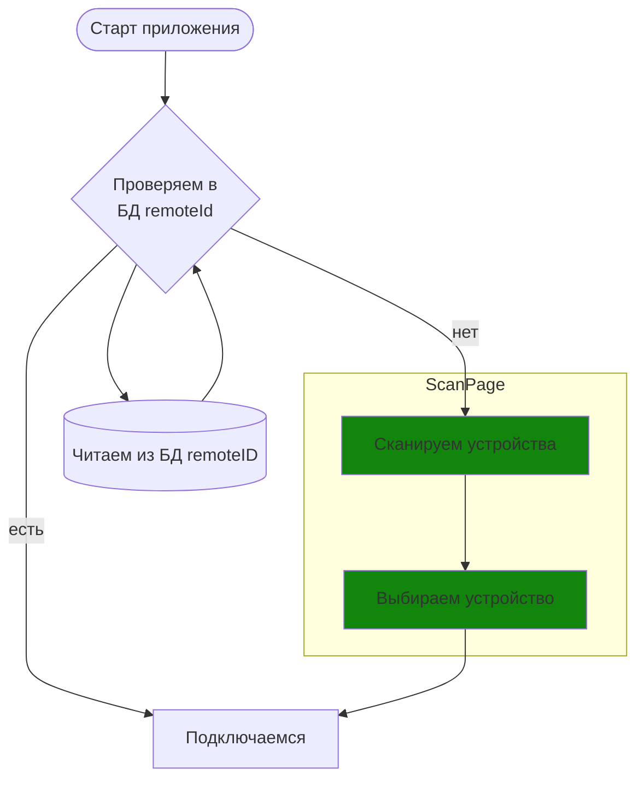

```mermaid

flowchart TB

  start@{shape: stadium, label: Старт приложения}
  getRemoteId@{shape: database, label: Читаем из БД remoteID}

  checkRemoteId@{shape: diamond, label: Проверяем в <br> БД remoteId}
  connect@{shape: rect, label: Подключаемся}
  
  subgraph scangraph[ScanPage]
  scan[Сканируем устройства]:::g
  pickDevice[Выбираем устройство]:::g
  end
  

  start --> checkRemoteId
  checkRemoteId --> getRemoteId
  getRemoteId --> checkRemoteId
  checkRemoteId --> |есть|connect
  checkRemoteId --> |нет|scan
  scan-->pickDevice
  pickDevice-->connect
  


classDef g fill:#12860c
classDef r fill:#ef1a0b
%% style scangraph fill:#12860c
```

