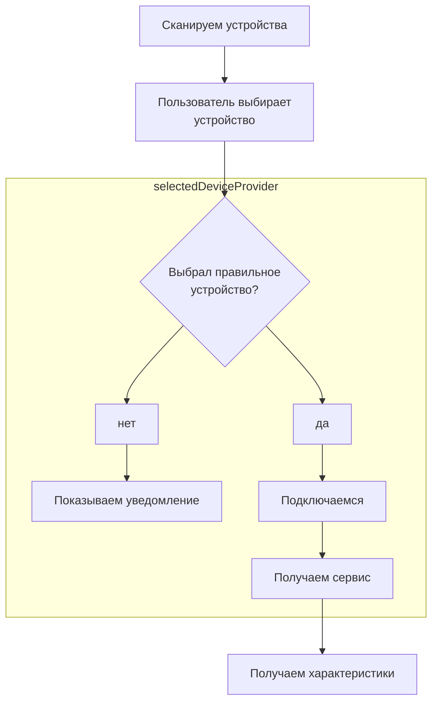

```mermaid
graph TB
    
    
        A[Сканируем устройства] --> B[Пользователь выбирает<br> устройство]
        
        B --> C{Выбрал правильное<br> устройство?}
        subgraph selectedDeviceProvider
        C --> D[да]
        C --> E[нет]
        E --> F[Показываем уведомление]
        
        D --> G[Подключаемся]
        G[Подключаемся] --> H[Получаем сервис]
        end
        H[Получаем сервис] --> K[Получаем характеристики]
```